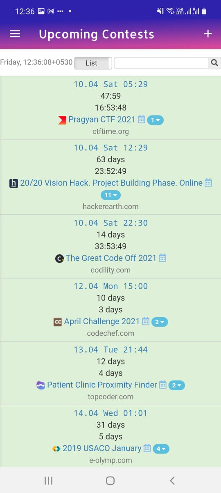

# MAD21_Codeforever

Team Name : CodeForever 
Team Members : Jasmeet Kaur, Sangeeta Meena 
Theme : Time Management And Productivity 

<ul>
<li>An Android application which can work as a single platform solution to coding, it’s analysis, contest updates and networking.</li>
  <li>The application is authenticated by mail-id and passwords.</li>
<li>It has a section containing information on worldwide current and  upcoming contests or hackathons.</li>
<li>It allows you to enter the details of problems you have solved every day, and analyze them on daily, weekly, and monthly basis by the visualization of this data.</li>
<li>The application also provides a tech forum to post a blog, review code, errors, etc.</li>
  </ul>

Tech-stack used: 
❏ Platform : Android 
❏ Build automation tool : Gradle 
❏ Engine : Android Studio 3.0.1 
❏ UI Development : Android-XML 
❏ Data Processing : Android-JAVA 
❏ Database : Firebase 

Functionalities : 
-> Login/SignUp Activity  
-> HomePage 
-> Side Navigation Menu 
-> Performance Analyzer 
-> Tech Forum 
-> Upcoming Contests Details 

Screeshots of app:

